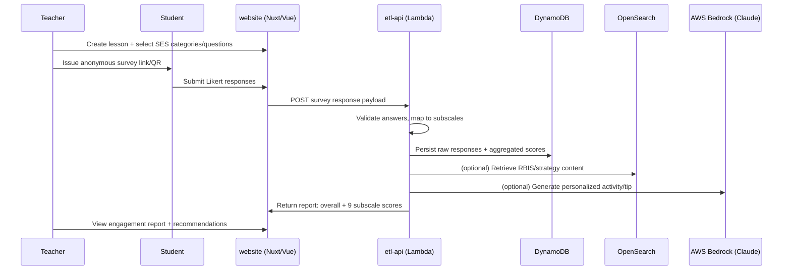

# LessonLoop Phase 1 Technical Report

**Date:** 2026-06-24  
**Scope:** Local environment verification + Student Engagement Survey (SES) → nine subscale scores trace  
**Workspace repo:** `https://github.com/ahsin211-dev/LessonLoop`  
**Status:** **Blocked — production source code not present in workspace**

---

## Executive Summary

Phase 1 could not be completed as specified because the assigned workspace contains only an **empty placeholder repository** (`README.md` with the single line `# LessonLoop`). The described production stack — separate **etl-api** (Node.js / Serverless / Lambda) and **website** (Vue 3 / Nuxt / PrimeVue) repositories with a Docker-based local dev environment — **was not found, cloned, or accessible** in this environment.

As a result:

- The Docker local environment **could not be started** (no `docker-compose` files; Docker CLI not installed on the VM).
- Backend endpoints, DynamoDB schemas, scoring modules, and frontend report components **could not be traced in code**.
- Tests **could not be run** (no application source).

This report documents what was verified, what was searched, what is known from **public LessonLoop marketing/research pages**, and what remains blocked pending access to the real repositories.

---

## 1. Local Setup Result

### Repositories cloned

| Repository | Expected | Actual in workspace |
|---|---|---|
| `LessonLoop` (meta/workspace) | Yes | Yes — `ahsin211-dev/LessonLoop` |
| `etl-api` (backend) | Yes | **Not found / not cloned** |
| `website` (frontend) | Yes | **Not found / not cloned** |

**Workspace contents (complete file list):**

```
/workspace/README.md          # contents: "# LessonLoop"
/workspace/.git/...
```

Git history: single commit `bfe382b` — "Initial commit" (2026-06-24).

### Environment setup steps followed

1. Inspected workspace root, `.git`, branches, submodules, and remotes.
2. Ran `git fetch --all` — only `main` branch exists.
3. Searched GitHub (public) for `lessonloop etl-api`, `lessonloop nuxt`, `lessonloop primevue`, `subscale`, `TEK-Base`, `serverless.yml lessonloop`.
4. Listed all public repos under `ahsin211-dev` — no `etl-api` or `website` repos.
5. Checked VM tooling: Node.js v22.14.0 and npm 10.9.7 present; **Docker not installed**.

### Docker commands used

**None.** No `docker-compose.yml`, `Dockerfile`, or local dev scripts exist in the workspace.

Attempted tooling check:

```bash
docker --version   # command not found
node --version     # v22.14.0
npm --version      # 10.9.7
```

### Services started

| Service | Status |
|---|---|
| Docker Compose stack | **Not attempted — no compose files, Docker unavailable** |
| etl-api (Lambda local) | **Not available** |
| website (Nuxt dev server) | **Not available** |
| DynamoDB Local | **Not available** |
| OpenSearch local | **Not available** |

### Required env vars / mocks

**Could not be determined from code.** Expected (per project brief) but unverified:

- AWS credentials / LocalStack or DynamoDB Local endpoints
- OpenSearch endpoint (local or stub)
- Bedrock / Claude API keys or local AI stub
- Auth / SSO configuration for teacher vs student routes
- Scrubbed seed data for surveys and reports

### Issues encountered and fixes

| Issue | Severity | Fix attempted | Result |
|---|---|---|---|
| Workspace contains no application source | **Blocker** | Searched GitHub org/user, public code search | No matching private/public repos found |
| `etl-api` and `website` repos missing | **Blocker** | `gh search repos`, `gh search code` | Not found under accessible accounts |
| Docker not installed on VM | **Blocker** | N/A (no compose files anyway) | Cannot run documented Docker setup |
| Public GitHub repos named "lessonloop" are unrelated projects | Info | Inspected `matthewbenn/lessonloop` | Next.js/Supabase coaching app — **different stack, not production SES platform** |

### Search attempts (code not found)

Keywords searched in workspace and public GitHub:

- `survey`, `engagement`, `subscale`, `score`, `report`, `SES`
- `etl-api`, `serverless.yml`, `PrimeVue`, `Nuxt`, `Bedrock`, `OpenSearch`
- `TEK-Base`, `StudentEngagement`, `subscale`

**Result:** Zero matches in workspace. No public GitHub repository matching the described Vue/Nuxt + Serverless + DynamoDB + Bedrock architecture was found.

---

## 2. Survey-to-Score Data Flow

> **Code trace status:** Not possible without `etl-api` and `website` repositories.  
> Below: **expected architecture** (from project brief) + **public product behavior** (from lessonloop.org).

### Expected end-to-end flow (to be verified once code is available)



### Publicly documented product flow (lessonloop.org)

1. **Set goal and create survey** — teacher selects from a bank of research-based questions across nine engagement categories.
2. **Teach and issue survey** — anonymous 1–2 minute pulse check at end of lesson; questions are randomly generated per category per administration.
3. **Gain insight** — platform produces engagement analytics; scores below **3.0** indicate room for improvement (per Engagement Spark examples).
4. **Select recommended strategy** — TEK-Base recommendation engine matches SES category/question to coaching tips and RBIS (research-based instructional strategies).
5. **AI-generated activity** — platform advertises AI customization of strategies for the next lesson.

### Backend endpoints / functions involved

| Item | Status |
|---|---|
| Survey submission route/handler | **Not found in workspace** |
| Scoring service/module | **Not found in workspace** |
| Report retrieval endpoint | **Not found in workspace** |
| `serverless.yml` function map | **Not found in workspace** |

### Data structures used

**Not found in code.** Expected entities (hypothesis for code review):

- `Lesson` / `Survey` / `SurveyQuestion` / `SurveyResponse`
- Aggregated `EngagementReport` with `overallScore` + `subscaleScores[]`
- Mapping table: `questionId → subscaleId → categoryGroup`

### DynamoDB / local table usage

**Not found in code.** No table names, key schemas, or local mock seed files were available.

### Scoring service / module

**Not found in code.**

### Frontend report rendering components

**Not found in code.** Expected locations once `website` repo is available:

- Nuxt pages under something like `pages/report` or `pages/lessons/[id]/report`
- Vue components for subscale charts/tables
- API client composable calling etl-api report endpoint

---

## 3. Nine Subscale Mapping

> **Code mapping status:** IDs, keys, and exact aggregation formulas **not found** — no source code access.  
> Public sources confirm **nine categories** exist and questions map to instructional goals, but the complete enumerated list with internal IDs is proprietary / not published in crawlable HTML.

### What public sources confirm

From [lessonloop.org/resources](https://lessonloop.org/resources/) and [lessonloop.org/solutions](https://lessonloop.org/solutions/):

- SES has a **valid and reliable overall engagement scale** and **nine categories**.
- Each category has: a definition, a best-practice/instructional goal, and linked survey questions.
- Students answer on a **5-point Likert scale**: Strongly Agree, Agree, Somewhat Agree, Disagree, Strongly Disagree.
- Educators can customize which categories to issue; questions within categories are **randomly generated** per administration.
- Platform gauges experience **cognitively, socially, emotionally, through lesson design, content accessibility, and technology use**.

### Publicly evidenced subscale / question-goal examples

| # | Display name / goal (public) | Category/group (public) | Example question (public) | Scoring notes (public) | Code definition |
|---|---|---|---|---|---|
| 1 | **Active Learning** | Cognitive | "I learned through activities and/or discussion in class, as opposed to passively listening to my teacher during this class lesson." | Score &lt; 3.0 = improvement area | **Not found** |
| 2 | **Active Learning** (variant) | Cognitive | "During the lesson I learned about the topic from my classmates in discussions or hands-on activities." | Score &lt; 3.0 = improvement area | **Not found** |
| 3 | **Curiosity** | Not specified publicly | "During the lesson, I got more curious about the topic." | Score &lt; 3.0 = improvement area | **Not found** |
| 4 | **Encourage Reflection** (truncated in crawl) | Not specified publicly | "In this class lesson, I had a chance to think about my classwork and …" | Score &lt; 3.0 = improvement area | **Not found** |
| 5–9 | Unknown names/IDs | Unknown | Not published in accessible public pages | Likely same 1–5 Likert → numeric scale | **Not found** |

### TEK-Base linkage (recommendation mapping)

From [lessonloop.org/solutions](https://lessonloop.org/solutions/):

- **TEK-Base** (Tips Engagement Knowledge-Base) recommends coaching tips based on:
  - SES **category**
  - SES **question**
  - Educator lesson description, grade, subject, tip hashtags
- Each tip includes: engagement goal by SES question, checklist, digital resources, RBIS links, searchable hashtags.

**Implication for code review:** subscale/category IDs likely drive TEK-Base retrieval filters and Strategy Hub category filters.

### Required follow-up once code is available

Search targets in `etl-api` and `website`:

```
subscale | subScale | category | engagementCategory | SES
score | scoring | aggregate | likert | cronbach
TEK-Base | tekBase | RBIS | strategy
```

Expected file areas:

- Backend: `services/scoring*`, `handlers/survey*`, `models/*`, `constants/subscales*`
- Frontend: report components, chart config, i18n labels for nine categories
- Shared: enum/constant mapping question → subscale

---

## 4. Scoring Logic Explanation

> **Code verification status:** Not possible. Below combines public product behavior + standard ed-survey practice. **All formulas are assumptions until confirmed in `etl-api`.**

### How raw answers are converted to scores (public evidence)

| Aspect | Public / inferred behavior | Code-confirmed |
|---|---|---|
| Response scale | 5-point Likert (Strongly Agree → Strongly Disagree) | No |
| Numeric mapping | Likely 5–1 or 1–5 integer mapping (standard practice; direction unknown) | No |
| Subscale score | Mean of mapped responses for questions in that subscale/category | No |
| Overall engagement score | Mean across subscales or all items (unknown weighting) | No |
| Interpretation threshold | **&lt; 3.0** indicates room for improvement (Engagement Spark posts) | Public only |
| Normalization | Unknown | No |
| Weighting | Unknown — possibly equal weight per question | No |
| Missing/incomplete responses | Unknown — survey is short (1–2 min); may require minimum N responses per lesson | No |
| Custom questions | Platform supports custom + humorous poll + secret word questions — scoring rules for non-standard items unknown | Public only |

### Edge cases to verify in code

1. **Low response count** — anonymous class-level survey; minimum students before showing report?
2. **Custom questions** — included in overall score or excluded from subscales?
3. **Partial category selection** — teacher issues subset of nine categories; how is overall score computed?
4. **Reverse-coded items** — any negatively worded items requiring inversion?
5. **Rounding** — one decimal place (consistent with 3.0 threshold messaging)?

---

## 5. AI / Recommendation Connection

> **Code trace status:** Not possible. Public product documentation only.

### Whether score outputs feed AWS Bedrock / Claude

- **Public:** LessonLoop markets an **AI-powered** platform with "AI Activity Generator" and "Use AI to Generate an Activity Customizing Instructional Strategy for Next Lesson."
- **Project brief:** AWS Bedrock with Claude Sonnet.
- **Code confirmation:** **Not found.**

### Where instructional strategy recommendations are generated

| System | Role (public) | Code location |
|---|---|---|
| **TEK-Base** | Primary content recommendation engine; maps SES category + question + educator context to coaching tips and RBIS | **Not found** |
| **Strategy Hub** | Browse/filter strategies by LessonLoop survey category and instructional frameworks (Danielson, CASEL, UDL, etc.) | **Not found** |
| **AWS Bedrock / Claude** | AI-generated lesson activities customizing strategies | **Not found** |
| **OpenSearch** | Likely retrieval for RBIS / tips knowledge base (per project brief) | **Not found** |

### OpenSearch retrieval usage

**Assumed** per stack description for RBIS/tip search. **Not verified.**

### Local AI stub

**Unknown.** Cannot confirm whether local Docker setup stubs Bedrock/OpenSearch or requires AWS credentials.

---

## 6. Privacy / Security Notes

> Based on project constraints + public product statements. **No code audit performed.**

### Student identifiers involved

- **Public:** SES is **anonymous**; designed for student voice without identifying individual respondents in teacher-facing reports.
- **Code:** Cannot verify whether responses store session tokens, device fingerprints, or class-roster linkage.

### PII vs scrubbed data

- Developers are expected to work against **scrubbed, PII-free local data** (per project brief).
- **Cannot verify** scrubbing scripts, seed data policies, or log redaction in code.

### Risky logging

- **Cannot audit.** Recommendation for code review: grep for `console.log`, student IDs, IP addresses, and raw survey payloads in Lambda handlers.

### Auth / permission assumptions (public)

- Educator lesson engagement reports are **confidential** to the educator and assigned Tip Master.
- Coaches with access must be non-supervisory and sign confidentiality agreements.
- Educators may voluntarily share reports.

### FERPA-relevant handling concerns

| Concern | Risk level | Notes |
|---|---|---|
| Anonymous survey design | Lower | Aligns with FERPA-minimization if truly de-identified at collection |
| Class/lesson-level aggregation | Medium | Even aggregate data can be sensitive in small classes |
| AI prompts including lesson context | Medium–High | Verify prompts do not include student identifiers |
| Logging in Lambda | High if misconfigured | Must audit before any dev debugging |
| Local dev seed data | High if prod export used | Confirm only scrubbed fixtures are used |

---

## 7. Estimate and Roadmap Opinion

Independent assessment based on **missing codebase access**. Effort is described by **technical scope**, not calendar time.

### Must-have — local dev completion

| Item | Classification | Scope |
|---|---|---|
| Grant access to `etl-api` and `website` private repos | **Must-have / Blocker** | Cannot proceed without source |
| Document and verify Docker-based local setup README | **Must-have** | Install Docker, run compose, confirm all services healthy |
| Provide scrubbed seed data + env var template | **Must-have** | `.env.example`, mock DynamoDB tables, survey fixtures |
| End-to-end local survey → report smoke test | **Must-have** | Submit fixture survey, verify nine subscale scores in UI |
| Document actual subscale ID mapping in repo | **Must-have** | Constants file or DB seed — should become internal docs |

### Security baseline

| Item | Classification | Scope |
|---|---|---|
| Audit Lambda logging for PII | **Must-have** | Especially survey submission and report handlers |
| Verify local dev cannot reach production AWS | **Must-have** | Profile/account guards, env separation |
| AuthZ review on report endpoints | **Must-have** | Teacher/coach/admin role boundaries |
| FERPA data-flow diagram | **Should-have** | Collection → storage → aggregation → AI prompts |
| Dependency / CVE scan in CI | **Should-have** | etl-api + website |

### Backend maintenance

| Item | Classification | Scope |
|---|---|---|
| Map and document all SES-related Lambda functions | **Must-have** | From `serverless.yml` |
| Unit tests for scoring module | **Should-have** | Likert mapping, missing data, partial categories |
| DynamoDB schema documentation | **Should-have** | Tables, GSIs, TTL, PII fields |
| Integration tests for survey submit → score persist | **Should-have** | |
| Serverless Framework / Node LTS upgrade path | **Optional** | Risk / needs clarification on current versions |

### AI roadmap

| Item | Classification | Scope |
|---|---|---|
| Document Bedrock prompt templates + inputs | **Must-have** | Confirm scores/questions feed prompts safely |
| OpenSearch index schema for RBIS/tips | **Should-have** | TEK-Base retrieval path |
| Local Bedrock/OpenSearch stubs for offline dev | **Should-have** | Reduce AWS dependency for new devs |
| Evaluate prompt injection / data leakage in AI activity generator | **Must-have** | Student quotes in prompts? |
| AI output review workflow (coach edits before save) | **Should-have** | Aligns with product behavior |

### SSO testing / support

| Item | Classification | Scope |
|---|---|---|
| Document IdP(s) supported (Google, Clever, ClassLink, etc.) | **Risk / needs clarification** | Not found in workspace |
| Local SSO mock or test tenant | **Should-have** | Required for auth-gated report pages |
| Role matrix: teacher, student (anonymous), coach, admin | **Must-have** | |

### Optional technical debt cleanup

| Item | Classification |
|---|---|
| Consolidate subscale constants across frontend/backend | Optional |
| Add OpenAPI spec for survey/report endpoints | Optional |
| Improve local dev one-command bootstrap | Should-have |
| Rename/document TEK-Base vs Bedrock responsibilities | Should-have |

---

## Appendix A — Investigation Checklist

| Step | Done | Result |
|---|---|---|
| Read README and local setup docs | Yes | Only `# LessonLoop` in README |
| Start Docker local environment | No | No compose files; Docker not installed |
| Run backend and frontend tests | No | No source |
| Inspect API routes / Lambda handlers | No | Repo missing |
| Search survey submission endpoints | No | Repo missing |
| Search score calculation logic | No | Repo missing |
| Search subscale definitions | No | Repo missing |
| Search frontend report components | No | Repo missing |
| Trace response payload to UI | No | Repo missing |
| Local survey submission test | No | App not runnable |
| Public documentation review | Yes | lessonloop.org resources/solutions |

## Appendix B — Public References

- [LessonLoop Resources (SES research, nine categories)](https://lessonloop.org/resources/)
- [LessonLoop Solutions (TEK-Base, nine categories)](https://lessonloop.org/solutions/)
- [LessonLoop homepage (5-step workflow, AI features)](https://lessonloop.org/)
- [Tools Competition — LessonLoop project description](https://tools-competition.org/winner/lessonloop/)

## Appendix C — Immediate Unblockers for Phase 2

1. Add `etl-api` and `website` repositories to the workspace (submodules, monorepo, or multi-root clone).
2. Provide internal README for Docker local setup with required env vars.
3. Provide scrubbed survey fixture that produces a known report (expected overall + nine subscale values).
4. Re-run this trace against actual code and replace Sections 2–4 with file-level citations.

---

*Report generated by Cursor Cloud Agent during Phase 1 familiarity task. Code-level assertions marked "Not found" require repository access to resolve.*
