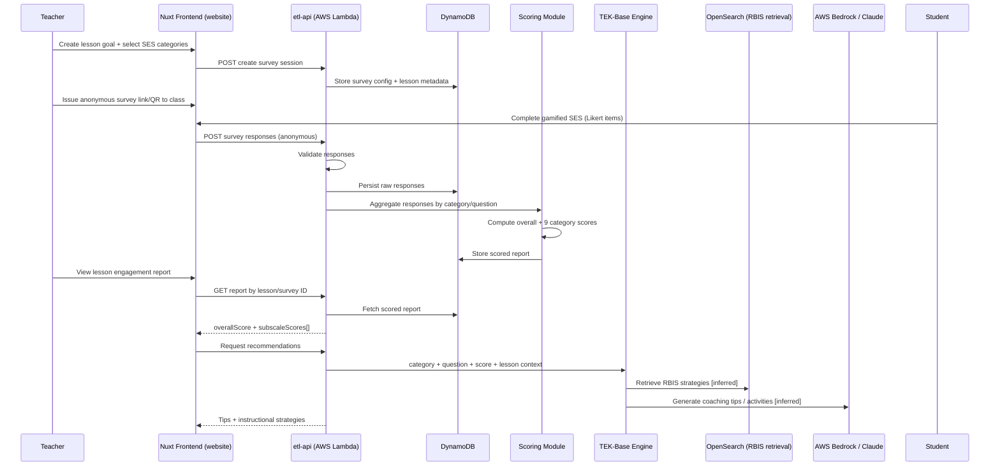

# LessonLoop Phase 1 — Codebase Review & Familiarity Task Report

**Date:** 2026-06-24  
**Author:** Cursor Cloud Agent (Phase 1 onboarding)  
**Scope:** Local environment verification, Student Engagement Survey (SES) → nine subscale scores trace, privacy review, and work-estimate opinion.

---

## Executive Summary

Phase 1 could **not be completed end-to-end** because the production application source code is **not present in the assigned workspace or accessible GitHub account**. The workspace repository [`ahsin211-dev/LessonLoop`](https://github.com/ahsin211-dev/LessonLoop) contains only a stub `README.md` (`# LessonLoop`). The described backend (`etl-api`) and frontend (Vue 3 / Nuxt / PrimeVue) repositories were not found via GitHub search, API lookup, or organization inspection.

What **was** completed:

- Exhaustive repository and environment investigation
- Public product/documentation research on lessonloop.org
- Identification of the **nine SES engagement categories** from official marketing copy
- Inferred high-level survey-to-report architecture from public sources
- Blocker documentation, risk assessment, and independent work-estimate opinion

**Critical blocker for Phase 2:** Grant read access to the private `etl-api` and website repositories (with Docker-based local setup docs) before code-level tracing can proceed.

---

## 1. Local Setup Result

### Repositories Cloned

| Repository | URL | Result |
|---|---|---|
| `ahsin211-dev/LessonLoop` | Pre-provisioned workspace | **Stub only** — `README.md` (13 bytes), no application code |
| `etl-api` (backend) | Not provided | **Not found** — 404 on `lessonloop/etl-api`, `LessonLoop/etl-api` |
| Website (Vue/Nuxt) | Not provided | **Not found** — 404 on `lessonloop/website`, `LessonLoop/website` |
| `matthewbenn/lessonloop` | Exploratory clone | **Unrelated** — Next.js golf-coaching POC (Supabase); removed after inspection |

### Environment Setup Steps Followed

1. Inspected workspace root (`/workspace`) — only `.git/` and `README.md`
2. Checked `git remote -v` → `origin https://github.com/ahsin211-dev/LessonLoop`
3. Listed all repos under `ahsin211-dev` via GitHub API — no `etl-api`, `website`, or similar
4. Searched GitHub for `lessonloop`, `etl-api`, `subscale`, `TEK-Base`, `serverless.yml` + lessonloop — no matching production codebase
5. Attempted org lookups (`lessonloop`, `LessonLoop`) — no accessible org repos
6. Verified tooling: **Node.js v22.14.0**, **npm 10.9.7** available; **Docker not installed** (`docker: command not found`)

### Docker Commands Used

**None.** No `docker-compose.yml`, `Dockerfile`, or local setup README exists in the workspace. Docker is not available in this cloud VM.

Expected commands (from project brief, **not verified**):

```bash
# Hypothetical — requires actual repo clone and setup docs
git clone <etl-api-repo-url>
git clone <website-repo-url>
cd etl-api && docker compose up -d
cd ../website && docker compose up -d
```

### Services Started

| Service | Status |
|---|---|
| DynamoDB Local | **Not started** — no backend repo |
| OpenSearch Local | **Not started** — no backend repo |
| etl-api (Serverless offline) | **Not started** — no backend repo |
| Nuxt frontend | **Not started** — no frontend repo |
| Docker daemon | **Unavailable** on VM |

### Required Env Vars / Mocks

**Not documented in workspace.** Based on the project brief (unverified without code):

- AWS credentials (or LocalStack) for Lambda, DynamoDB, Bedrock, OpenSearch
- Scrubbed/PII-free local seed data
- Auth/SSO mock or dev bypass
- Bedrock/OpenSearch stubs for offline AI and retrieval

### Issues Encountered and Fixes

| Issue | Impact | Fix / Next Step |
|---|---|---|
| Workspace repo is empty stub | Cannot trace any code paths | Request private repo access from LessonLoop engineering |
| `etl-api` and website repos missing | No endpoints, scoring logic, or UI to inspect | Obtain clone URLs and branch strategy |
| Docker not installed on VM | Cannot run documented Docker local stack even if repos were present | Install Docker or provide non-Docker local dev path |
| GitHub API rate limiting during broad search | Slowed discovery | Waited and retried; still no matching repos |
| Public GitHub repos named "LessonLoop" are unrelated projects | Risk of analyzing wrong codebase | Confirmed `matthewbenn/lessonloop` is a golf-coaching POC, not SES platform |

---

## 2. Survey-to-Score Data Flow

> **Evidence level:** Sections 2–4 below combine **public product documentation** with **architectural expectations from the project brief**. No backend handler, DynamoDB entity, or scoring function was inspected because source code is unavailable. Items marked **[CODE NOT FOUND]** require repository access to confirm.

### High-Level Flow (Public Documentation + Inferred Architecture)



### Step-by-Step Flow

| Step | Actor | Action | Source |
|---|---|---|---|
| 1 | Teacher | Set professional learning goal; choose which of the nine SES categories to include | [lessonloop.org](https://lessonloop.org/) workflow |
| 2 | Teacher | Teach lesson; issue anonymous SES (link/QR) at end of class | Public workflow |
| 3 | Student | Complete 1–2 minute gamified survey; questions randomly drawn from selected categories | [Solutions page](https://lessonloop.org/solutions/) |
| 4 | Platform | Validate and store anonymous responses | **[CODE NOT FOUND]** |
| 5 | Platform | Compute overall engagement score and nine category scores | **[CODE NOT FOUND]** |
| 6 | Teacher | Review instant lesson engagement report | Public workflow; sample report referenced in [Rachelle Poth blog](https://rdene915.com/2022/10/18/reflective-teaching-and-powerful-professional-learning-with-lessonloop/) |
| 7 | Platform | TEK-Base recommends coaching Tips and RBIS strategies based on lowest-scoring categories/questions | [Solutions page](https://lessonloop.org/solutions/) |
| 8 | Teacher | Optionally use AI Activity Generator and Blindspot Checker | [Digital Promise press release](https://lessonloop.org/press-release-lessonloop-wins-earns-ai-certification-from-digital-promise/) |
| 9 | Admin (optional) | Aggregate school/grade/subject engagement analytics | Public marketing copy |

### Backend Endpoints / Functions

**[CODE NOT FOUND]** — Searched workspace and public GitHub; no `serverless.yml`, route handlers, or Lambda function names available.

Expected areas (from brief, unverified):

- Survey creation / issuance endpoint
- Anonymous response submission endpoint
- Report retrieval endpoint (overall + subscales)
- Recommendation / TEK-Base endpoint
- AI activity generation endpoint (Bedrock)

### Data Structures

**[CODE NOT FOUND]** — Inferred shapes based on public product behavior:

```typescript
// INFERRED — not verified against codebase
interface SurveyResponse {
  surveySessionId: string;
  lessonId: string;
  questionId: string;
  categoryKey: string;       // one of nine categories
  answerValue: number;       // Likert 1–5 [inferred from public example]
  submittedAt: string;
  // No student PII per product design
}

interface EngagementReport {
  lessonId: string;
  surveySessionId: string;
  overallEngagementScore: number;
  subscaleScores: SubscaleScore[];
  responseCount: number;
  freeTextResponses?: string[];
}

interface SubscaleScore {
  categoryKey: string;
  displayName: string;
  score: number;
  questionScores: QuestionScore[];
}
```

### DynamoDB / Local Table Usage

**[CODE NOT FOUND]**

Expected entities (inferred): `Survey`, `SurveySession`, `SurveyResponse`, `EngagementReport`, `Lesson`, `InstructionalStrategy`, `CoachingTip`.

### Scoring Service / Module

**[CODE NOT FOUND]**

Public documentation states scoring is psychometrically validated (Cronbach's alpha) at the overall scale and nine-category level ([Resources page](https://lessonloop.org/resources/)), but the implementation module, file path, and formula are not accessible.

### Frontend Report Rendering

**[CODE NOT FOUND]**

Expected locations (from brief, unverified):

- Nuxt pages/routes for lesson engagement report
- Vue/PrimeVue components for subscale charts or score cards
- API client composable fetching report payload

Public reference: Rachelle Poth's blog shows a "Sample Lesson Engagement Report" UI with category breakdowns, but image details were not machine-readable.

---

## 3. Nine Subscale Mapping

Official category names are documented on the [About Us page](https://lessonloop.org/about-us/):

> "cognitively, socially, emotionally, self-regulation, student agency, mitigating factors, lesson design, content accessibility, and technology use"

The platform also uses the terms **"categories"** and **"subscales"** interchangeably in public copy ([Resources page](https://lessonloop.org/resources/) uses "cognitive subscale" for the Active Learning example).

### Category Table

| # | ID/Key (inferred) | Display Name | Group | Related Survey Items | Scoring / Aggregation | Defined In |
|---|---|---|---|---|---|---|
| 1 | `cognitive` | Cognitive | Learner experience | e.g., Active Learning: *"I learned through activities and/or discussion in class, as opposed to passively listening to my teacher during this class lesson."* | **[CODE NOT FOUND]** — Likert mean per category [inferred] | Public: [Resources](https://lessonloop.org/resources/); Code: **not found** |
| 2 | `social` | Social | Learner experience | Randomized from category question bank | **[CODE NOT FOUND]** | Public: [About Us](https://lessonloop.org/about-us/); Code: **not found** |
| 3 | `emotional` | Emotional | Learner experience | Randomized from category question bank | **[CODE NOT FOUND]** | Public: [About Us](https://lessonloop.org/about-us/); Code: **not found** |
| 4 | `self-regulation` | Self-Regulation | Learner experience | Randomized from category question bank | **[CODE NOT FOUND]** | Public: [About Us](https://lessonloop.org/about-us/); Code: **not found** |
| 5 | `student-agency` | Student Agency | Learner experience | Randomized from category question bank | **[CODE NOT FOUND]** | Public: [About Us](https://lessonloop.org/about-us/); Code: **not found** |
| 6 | `mitigating-factors` | Mitigating Factors | Learner experience | Randomized from category question bank | **[CODE NOT FOUND]** | Public: [About Us](https://lessonloop.org/about-us/); Code: **not found** |
| 7 | `lesson-design` | Lesson Design | Instructional design | Randomized from category question bank | **[CODE NOT FOUND]** | Public: [About Us](https://lessonloop.org/about-us/); Code: **not found** |
| 8 | `content-accessibility` | Content Accessibility | Instructional design / UDL | Randomized from category question bank | **[CODE NOT FOUND]** | Public: [About Us](https://lessonloop.org/about-us/); Code: **not found** |
| 9 | `technology-use` | Technology Use | Instructional design | Randomized from category question bank | **[CODE NOT FOUND]** | Public: [About Us](https://lessonloop.org/about-us/); Code: **not found** |

### Publicly Documented Answer Scale (Cognitive / Active Learning Example)

| Answer Choice | Notes |
|---|---|
| Strongly Agree | 5-point Likert per [Resources page](https://lessonloop.org/resources/) |
| Agree | |
| Somewhat Agree | |
| Disagree | |
| Strongly Disagree | |

Numeric mapping (1–5) is **inferred**; codebase mapping **[CODE NOT FOUND]**.

### Additional Survey Item Types (Not Subscales)

- Custom teacher-authored questions
- Humorous poll (engagement game)
- Secret word game
- Free-text responses (shown in sample reports)

These may or may not feed subscale scores — **[CODE NOT FOUND]**.

---

## 4. Scoring Logic Explanation

> All implementation details below are **inferred from public documentation** unless marked otherwise.

### Raw Answer → Score Conversion

- SES uses a **validated overall engagement scale** plus **nine category subscales** developed via literature review, expert panel, and pilot testing; reliability tested with **Cronbach's alpha** ([Resources](https://lessonloop.org/resources/)).
- Each category has multiple questions in a bank; **one question per selected category is randomly chosen** per survey administration ([Solutions](https://lessonloop.org/solutions/)).
- Teachers can **customize which categories** are issued per survey.
- Instructional strategies are assigned based on **grade, subject, lesson, category, specific question, and question score** ([About Us](https://lessonloop.org/about-us/)).

### Scale / Range

| Level | Expected Range | Evidence |
|---|---|---|
| Per-question | Likert 1–5 (inferred) | Public 5-choice example |
| Per-category subscale | Unknown — likely mean or normalized percentage | **[CODE NOT FOUND]** |
| Overall engagement | Unknown — likely aggregate of category scores | **[CODE NOT FOUND]** |

### Normalization

**[CODE NOT FOUND]** — No evidence of z-score or percentile normalization in public docs. Reports are described as "instant" and "actionable" for teachers, suggesting raw or simple scaled averages.

### Weighting

**[CODE NOT FOUND]** — No public documentation of differential category weights. Teachers select which categories to include, which implicitly weights omitted categories to zero for that survey.

### Missing / Incomplete Responses

**[CODE NOT FOUND]** — Product is anonymous and gamified; minimum response thresholds for report generation are not documented publicly.

### Edge Cases

| Edge Case | Handling |
|---|---|
| Teacher selects subset of 9 categories | Only selected categories appear in report [public] |
| Single student response vs. class aggregate | Report likely aggregates class responses [inferred]; implementation **[CODE NOT FOUND]** |
| Custom questions | May appear in report separately; subscale impact **[CODE NOT FOUND]** |
| Free-text responses | Displayed in report [public blog]; not scored into subscales [inferred] |

---

## 5. AI / Recommendation Connection

### Whether Score Outputs Feed AWS Bedrock / Claude

**Partially confirmed publicly; implementation not found in code.**

- Project brief states: AWS Bedrock with Claude Sonnet.
- Public sources confirm:
  - **TEK-Base** — content recommendation engine using SES category, question, educator lesson description, grade, subject, and hashtags ([Solutions](https://lessonloop.org/solutions/))
  - **AI Activity Generator** — generates lesson activities from human-authored instructional strategies ([Digital Promise press release](https://lessonloop.org/press-release-lessonloop-wins-earns-ai-certification-from-digital-promise/))
  - **Blindspot Checker** — AI review for inclusivity/accessibility in generated activities
  - Nona Ullman interview ([The Learning Agency](https://the-learning-agency.com/the-cutting-ed/article/5-questions-with-nona-ullman/)): platform uses AI to analyze engagement and generate activities

**Inferred flow:** Low subscale scores → TEK-Base selects RBIS strategies → Bedrock generates customized coaching tips/activities.

### Instructional Strategy Recommendations

- **RBIS database**: 2,500+ research-based instructional strategies with citations ([lessonloop.org](https://lessonloop.org/))
- Curated by CPET at Teachers College, Columbia University
- Strategies mapped to **specific SES questions** to improve that question's score ([Resources](https://lessonloop.org/resources/) Active Learning example)
- Human **Tip Masters** can accept or override TEK-Base recommendations

### OpenSearch Retrieval Usage

**[CODE NOT FOUND]** — Mentioned in project brief for search/retrieval of instructional strategies. Likely backs TEK-Base RBIS lookup, but no code or config verified.

### Local AI Stubbing

**[CODE NOT FOUND]** — No local dev repo to inspect. Expected pattern: Bedrock/OpenSearch mocked or pointed at LocalStack in Docker environment.

---

## 6. Privacy / Security Notes

Based on public product design and FERPA-aware development constraints from the project brief.

### Student Identifiers

| Data | PII Status | Notes |
|---|---|---|
| SES responses | **Anonymous by design** | No student login for surveys ([public docs](https://lessonloop.org/student-engagement-survey-questionnaires/)) |
| Student name/ID in survey flow | **Not described publicly** | Should be absent; verify in code |
| Teacher / school accounts | **PII** | Authenticated educator accounts expected |
| Free-text responses | **Potential indirect identification** | Risk if students self-identify; content moderation unknown |
| Aggregated admin analytics | **De-identified aggregates** | School/grade/subject level ([public docs](https://lessonloop.org/sel-alignment/)) |

### PII vs Scrubbed Local Data

- Developers should work against **scrubbed, PII-free local data** (project brief).
- Local seed data contents and scrubbing process: **[CODE NOT FOUND]**

### Risky Logging

- **Cannot audit** — no codebase access.
- **Requirement:** Do not log student identifiers in dev/debug paths.
- **Verify when code available:** Lambda CloudWatch logs, API Gateway access logs, frontend analytics, Bedrock prompt content.

### Auth / Permission Assumptions

| Role | Expected Access |
|---|---|
| Student | Anonymous survey submission only |
| Teacher | Own lesson reports (confidential) |
| Tip Master / Coach | Assigned teacher reports (confidentiality agreement required) ([Solutions](https://lessonloop.org/solutions/)) |
| Administrator | Aggregated analytics; not individual teacher reports without voluntary sharing |
| Supervisory admin access to individual reports | **Explicitly restricted** — coaches must be non-supervisory |

### FERPA-Relevant Handling

- Platform positions itself as **professional learning, not accountability** ([student engagement survey page](https://lessonloop.org/student-engagement-survey-questionnaires/))
- Reports are **confidential to the educator** by default
- Anonymous survey design reduces FERPA exposure for student-level records
- **Risks to validate in code:**
  - Whether survey sessions can be correlated to individual students via device/session tokens
  - Whether AI prompts include identifiable student free-text in logs
  - Data retention and deletion policies for responses and reports
  - Cross-tenant data isolation in DynamoDB

---

## 7. Estimate and Roadmap Opinion

Estimates reflect work **after** repository access is granted. Classifications: **Must-have**, **Should-have**, **Optional**, **Risk / needs clarification**.

### Must-Have — Local Dev Completion

| Item | Scope | Notes |
|---|---|---|
| Private repo access + onboarding docs | Grant GitHub access to `etl-api` and website repos; document clone URLs, branches, required AWS profile | **Blocker** — nothing else can proceed |
| Docker local environment | Verify `docker compose up` starts DynamoDB Local, API, frontend, mocks | Docker required on dev machines; was missing on this VM |
| Scrubbed seed data | Document seed scripts, table names, sample survey → report fixture | FERPA prerequisite |
| SES scoring trace | Map handler → validation → DynamoDB → scoring → report API → UI component | Core familiarity deliverable |
| Run test suites | Backend unit/integration + frontend tests in CI parity | Establish baseline pass rate |

### Must-Have — Security Baseline

| Item | Scope |
|---|---|
| Audit logging for PII | Review all Lambda handlers and frontend error reporting for student data leakage |
| AuthZ matrix | Document role-based access for reports, admin aggregates, Tip Master views |
| Secrets management | Verify no production keys in repos; SSM/Secrets Manager patterns |
| Anonymous survey token security | Ensure survey links cannot enumerate other sessions |

### Should-Have — Backend Maintenance

| Item | Scope |
|---|---|
| Serverless Framework / Node.js LTS alignment | Dependency audit on etl-api |
| DynamoDB access patterns | Review GSIs, hot partitions on survey submission bursts |
| Scoring module tests | Unit tests for edge cases (partial responses, single respondent) |
| API contract documentation | OpenAPI or shared types between etl-api and website |
| CI/CD hardening | Confirm test gates block deploy on failure |

### Should-Have — AI Roadmap

| Item | Scope |
|---|---|
| TEK-Base → Bedrock pipeline documentation | Prompt templates, input variables, score thresholds |
| OpenSearch RBIS index | Mapping, reindex process, relevance tuning |
| Blindspot Checker evaluation | Bias/accessibility test suite for generated activities |
| Local AI stubs | Deterministic mock for Bedrock/OpenSearch in Docker dev |

### Should-Have — SSO Testing / Support

| Item | Scope |
|---|---|
| Educator SSO flows | Test district IdP integrations (Google, Clever, ClassLink, etc. — **actual providers need clarification**) |
| Role provisioning | Teacher vs coach vs admin from SSO claims |
| Student anonymous path | Confirm SSO is not required for SES (expected) |

### Optional — Technical Debt Cleanup

| Item | Scope |
|---|---|
| Shared subscale constants package | Single source of truth for nine category IDs across frontend/backend |
| TypeScript strictness / lint alignment | If not already enforced |
| PrimeVue component standardization | Report UI consistency |
| Dead code removal in etl-api | After scoring trace identifies unused paths |

### Risk / Needs Clarification

| Item | Question |
|---|---|
| Repository location | Where are `etl-api` and website hosted? Private org name? |
| Subscale ID canonical keys | Are keys `cognitive`, `self-regulation`, etc., or different enums in DynamoDB? |
| Scoring formula | Mean Likert? Reverse-coded items? Category score = mean of all questions or single random question? |
| Minimum N responses | Is a report generated with 1 student response? |
| `lessonloop.net` vs `lessonloop.org` | Search results show `lessonloop.net` with different product (studio/music) — confirm domain/product separation |
| Production access policy | Will engineers ever need read-only prod access, or local-only forever? |
| Bedrock model version | Claude Sonnet — which exact model ID in production? |

---

## Appendix A: Search Attempts (No Code Found)

Keywords searched in workspace and public GitHub:

- `survey`, `engagement`, `subscale`, `score`, `report`, `SES`
- `student engagement`, `TEK-Base`, `RBIS`
- `serverless.yml`, `etl-api`, `Bedrock`, `OpenSearch`
- `DynamoDB`, `PrimeVue`, `Nuxt`

Files expected but absent:

- `serverless.yml`
- Lambda handlers under `handlers/`, `src/`, or `functions/`
- Scoring modules (`scoring`, `subscale`, `engagement`)
- DynamoDB repositories / entity definitions
- Nuxt `pages/`, `components/` for report display
- `docker-compose.yml`
- Local setup README

## Appendix B: Useful Public References

| Resource | URL |
|---|---|
| Product homepage | https://lessonloop.org/ |
| Nine categories (About Us) | https://lessonloop.org/about-us/ |
| SES validation / Active Learning example | https://lessonloop.org/resources/ |
| TEK-Base / platform features | https://lessonloop.org/solutions/ |
| Anonymous survey design | https://lessonloop.org/student-engagement-survey-questionnaires/ |
| AI certification / Activity Generator | https://lessonloop.org/press-release-lessonloop-wins-earns-ai-certification-from-digital-promise/ |
| Tools Competition profile | https://tools-competition.org/winner/lessonloop/ |
| Educator blog with sample report | https://rdene915.com/2022/10/18/reflective-teaching-and-powerful-professional-learning-with-lessonloop/ |

## Appendix C: Recommended Next Steps

1. **Grant repository access** to `etl-api` and website repos with local setup README.
2. **Re-run Phase 1** on a machine with Docker installed.
3. **Trace scoring** starting from survey POST handler → DynamoDB write → scoring function → report GET → Nuxt report page.
4. **Extract canonical subscale enum** from shared constants or database seed files.
5. **Run test suites** and document pass/fail baseline.
6. **Submit a local survey** using seed data and capture the report JSON payload for documentation.

---

*Report generated during Phase 1 onboarding. Code-level claims will be updated once private repositories are available.*
